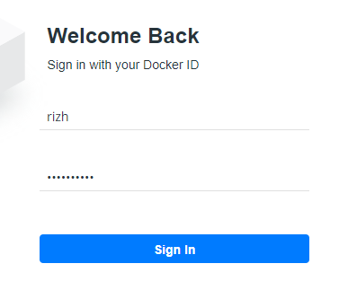

# UTS

1. MEMBUAT AKUN DOCKERHUB



2. MEMBUAT FOLDER "RIZH"
```
C:\Users\User> mkdir rizh
C:\Users\User> cd rizh
C:\Users\User\rizh> ls
    Directory: C:\Users\User\rizh
Mode                LastWriteTime         Length Name
----                -------------         ------ ----
-a----       10/28/2019   9:18 PM             47 Dockerfile
-a----       10/28/2019   9:29 PM            158 RIZH38.html
 ```

 3. ISI FOLDER TERSEBUT PASTIKAN SUDAH ADA "DOCKERFILE"nya, jika belum maka buat file yang isinya script berikut

 ```
 FROM nginx:alpine
COPY . /usr/share/nginx/html
 ```

 4. KEMUDIAN BUILD IMAGE
 ```
 PS C:\Users\User\rizh> docker build -t rizh/rizh:v1 .
Sending build context to Docker daemon  3.072kB
Step 1/2 : FROM nginx:alpine
 ---> b6753551581f
Step 2/2 : COPY . /usr/share/nginx/html
 ---> e69d8f68ab90
Successfully built e69d8f68ab90
Successfully tagged rizh/rizh:v1
```

CEK DOCKER IMAGE
```
PS C:\Users\User\rizh> docker images
REPOSITORY                TAG                 IMAGE ID            CREATED             SIZE
rizh/rizh                 v1                  e69d8f68ab90        51 seconds ago      21.4MB
nginx                     alpine              b6753551581f        5 days ago          21.4MB
cockroachdb/cockroach     latest              82ebb27f44e8        4 weeks ago         190MB
ubuntu                    latest              2ca708c1c9cc        5 weeks ago         64.2MB
 ```

 5. MENJALANKAN IMAGE
 ```
 PS C:\Users\User\rizh> docker run -d -p 9090:80  --name=rizh rizh/rizh:v1
0f12ddba6191c41d5c46b4a4d878ad4972c4211434d9f162a533a9271cdcd778
 ```

 6. PUSH IMAGE KE DOCKER HUB
 ```
 $ docker push rizh/rizh:v1
 ```

 7. tes di localhost
 ```
 
 ```