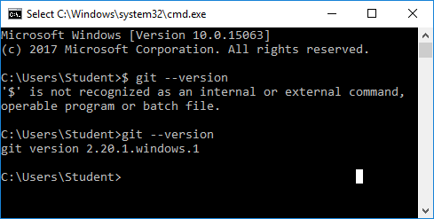
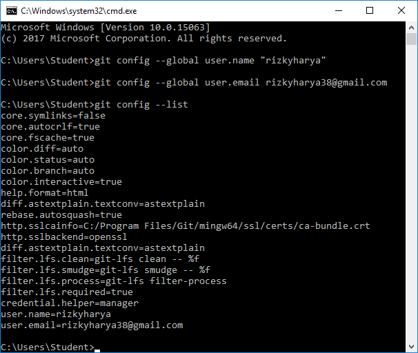
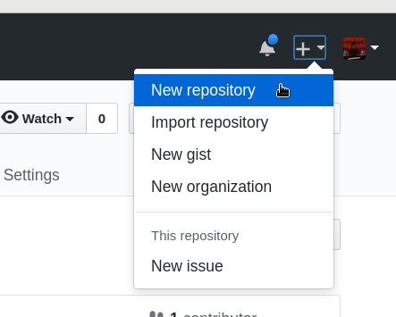

# PRAKTIKUM KCC MINGGU 1

##### "RIZKY HARYA / 175410001"

Langkah 1 pastikan Github sudah terinstal, dapat di cek di CMD
dengan perintah
```git --version```



jika belum, dapat diinstal di https://git-scm.com/downloads

Langkah 2 konfigurasi Git
buka cmd dan ketikan perintah
```
git config --global user.name "Nama Anda di GitHub"
git config --global user.email email@domain.tld
```


Langkah 3 Kelola repo anda
buka akun Github anda kemudian klik bagian **+** New repository

kemudian namai repo anda lalu klik **create repository**

setelah itu clone repo anda menggunakan perintah
```git clone https://github.com/rizkyharya/tcc.git```
kemudian membuat file bernama **README.md**
kelola file tersebut sesuai keinginan anda

kemudian di Push
dengan perintah
```
git add -A
git status
```

```
git commit -m "Add: isi README.md"
```

```
git push origin edit-readme-1
```
