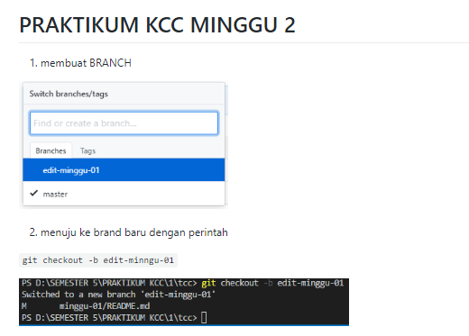
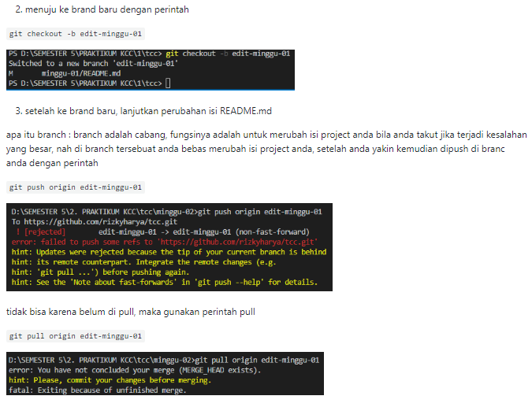
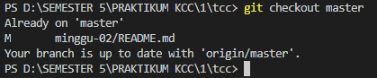

# PRAKTIKUM KCC MINGGU 2 #

1. membuat BRANCH


2. menuju ke brand baru dengan perintah

```git checkout -b edit-minggu-01```


3. setelah ke brand baru, lanjutkan perubahan isi README.md

apa itu branch : branch adalah cabang, fungsinya adalah untuk merubah isi project anda bila anda takut jika terjadi kesalahan yang besar, nah di branch tersebuat anda bebas merubah isi project anda, setelah anda yakin kemudian dipush di branc anda dengan perintah

```git push origin edit-minggu-01```


tidak bisa karena belum di pull, maka gunakan perintah pull

```git pull origin edit-minggu-01```


setelah itu kemudian diAdd kemudian commit, baru kemudian diPush di branch yang baru, setelah itu diCek di branch master perubahan pada isi project.



hanya sampai di keterangan no.2, kemudian lihat di branch edit-minggu-01



project sampai pada keterangan no 3. nah jika sudah yakin maka di merge agar perubahan sampai pada branch master.

4. merge, kembali ke branch master dahulu dengan peintah

```git checkout master```

```git merge edit-minggu-01```



