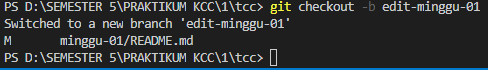

# PRAKTIKUM KCC MINGGU 2 17/09/2019

##### "RIZKY HARYA / 175410001"

Mengubah Isi dengan Branching and Merging
langkah :
1. membuat branch baru dengan perintah
```git checkout -b edit-readme-1```

2. 