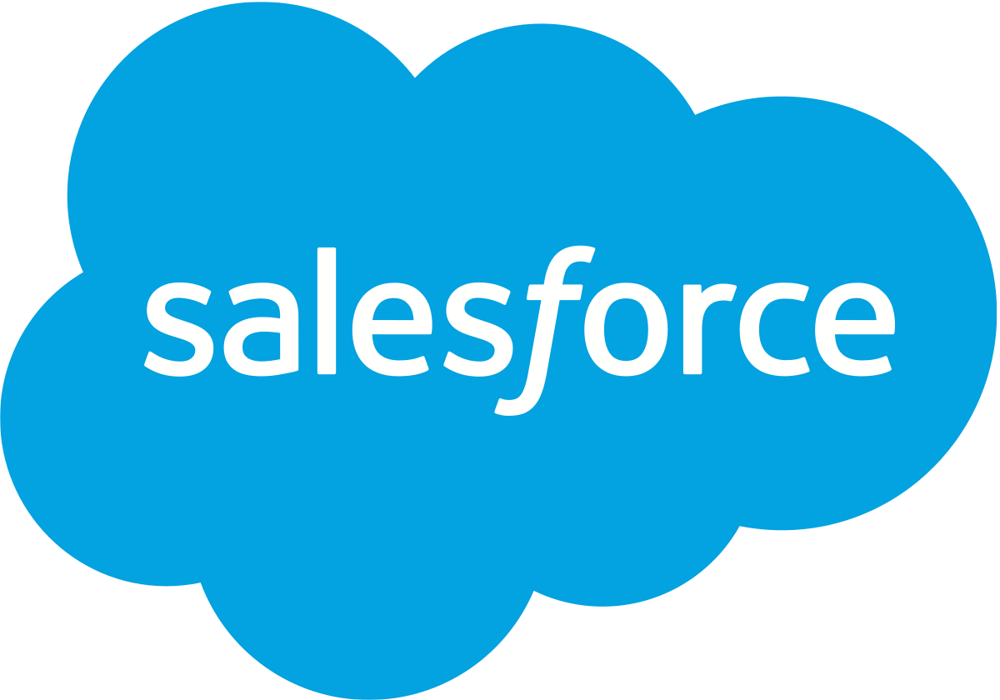

# PRAKTIKUM KCC MINGGU 1

SaaS (Software as a Service) merupakan layanan yang mana pengguna tinggal menggunakan aplikasi tersebut tanpa harus mengerti dan mengatur bagaimana data disimpan atau bagaimana aplikasi tersebut di maintenance, karena hal tersebut merupakan service yang disediakan penyedia layanan.

Keuntungan:

Pengguna dapat langsung memanfaatkan layanan secara gratis atau dengan bayar biaya sewa tanpa harus mengeluarkan investasi untuk membuat sendiri (in-house development) atau membeli lisensi yang relatif mahal.
Ketersediaan dan reliabilitas aplikasi terjamin oleh penyedia layanan. Pengguna hanya perlu fokus pada data miliknya. Perangkat yang dibutuhkan oleh pengguna juga hanya komputer dan internet.

Kerugian:  

Pengguna tidak memiliki kendali penuh atas aplikasi yang disewa. Pengguna tidak dapat dengan seenaknya mengubah fitur-fitur yang disediakan karena SaaS bersifat multi-tenant sehingga fitur-fitur yang dibuat adalah fitur yang umum (tidak bisa spesifik terhadap kebutuhan pengguna tertentu). Pada beberapa aplikasi, kustomisasi dapat dilakukan dengan skala dan fungsi yang terbatas.

Beberapa contoh SAAS.
- Salesforce.com

- Dropbox

- Google Services

- Prezi

