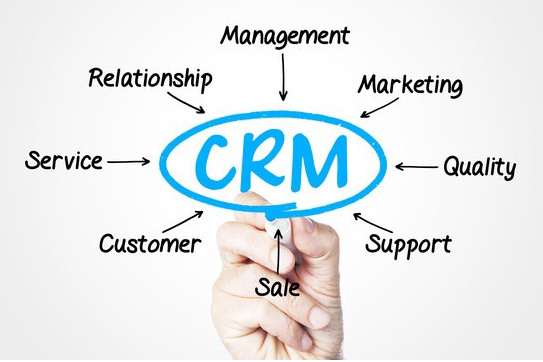
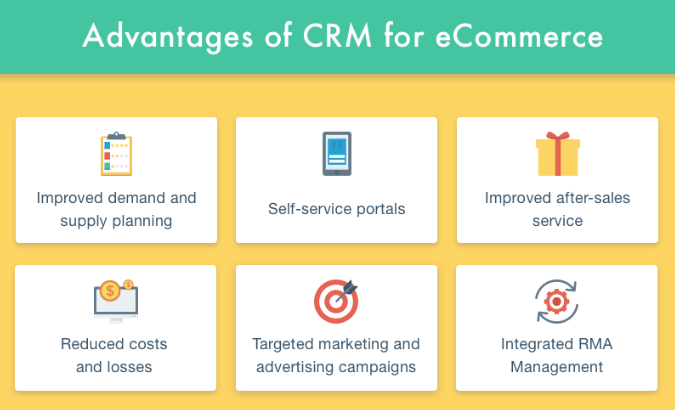
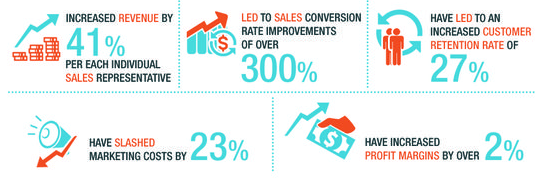

# PRAKTIKUM KCC MINGGU 4

https://medium.com/barantum/apa-itu-crm-e8c3db28f97e

CRM ?

CRM — Customer Relationship Management — adalah software sistem informasi yang membantu individu dan tim memaksimalkan komunikasi dengan pelanggan dan upaya penjualan mereka. CRM dapat membangun hubungan yang lebih efektif dan memberikan pengalaman pelanggan yang terbaik.

Platform CRM berbasis cloud modern dapat diakses dari perangkat apa pun, yang artinya transaksi Anda tidak semua terjebak di kantor. Dengan akses mobile CRM dan pemberitahuan ponsel smartphone Anda, Sales Anda tidak akan kehilangan sesuatu yang penting, baik di pesawat, di kantor klien, atau sedang rapat.

Apa yang CRM bisa lakukan untuk saya?

etika bisnis Anda baru dimulai, Anda akan melacak pelanggan melalui email, buku alamat dan spreadsheet. Tetapi sekarang perusahaan Anda sedang bertumbuh dan itu berarti, lebih banyak peluang untuk mengubah cara Anda menjalankan bisnis Anda.
- Spreadsheet ? sulit untuk diperbarui, sulit untuk tetap sinkron dengan data yang tim Anda miliki.
- Informasi pelanggan yang berharga tersimpan di kotak masuk / inbox email karyawan Anda.
- Catatan ? bisa saja hilang atau dibuang.
- Komunikasi pelanggan pun menjadi tidak konsisten antara karyawan Anda.

nah Di situlah peran dari Aplikasi CRM

Aplikasi CRM membantu Anda dan tim Anda
1. Menggabungkan semua data Anda ke dalam satu lokasi yang mudah diakses. CRM memusatkan data pelanggan Anda sehingga setiap orang di perusahaan Anda dapat mengakses semua informasi yang mereka butuhkan dari satu platform.
2. Jual lebih banyak dan lebih cepat. Harus melakukan entri data secara manual adalah salah satu penyebab hilangnya produktivitas terbesar dari tenaga penjualan/ tim sales Anda. Dengan CRM maka Anda dapat mengotomatiskan banyak tugas admin yang berulang ini. Sehingga tim Anda dapat menghabiskan lebih sedikit waktu untuk mengetik dan lebih banyak waktu untuk memaksimalkan penjualan.
3. DLL

