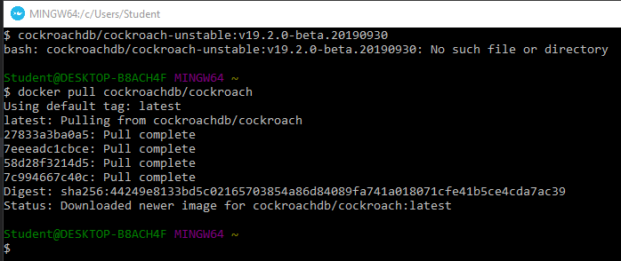
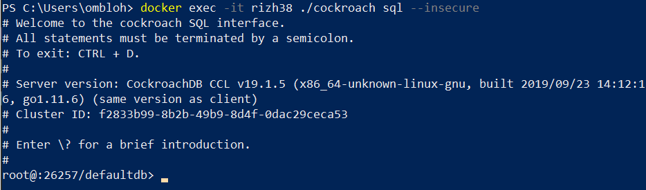
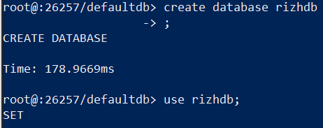
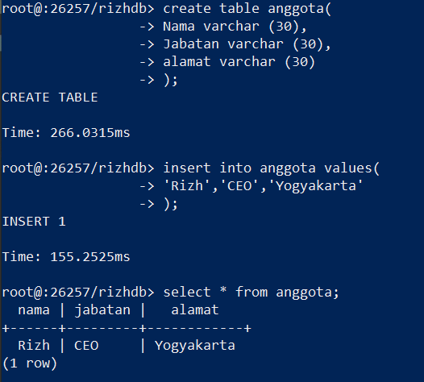

# PRAKTIKUM KCC MINGGU 5

COCKROACHDB

INSTAL

BUKA DOCKER KEMUDIAN COPY PERINTAH "docker pull cockroachdb/cockroach"

Menjalankan Container cockroachdb

Masuk ke container

Membuat database dan menggunakan database

membuat table dan mengisi table

