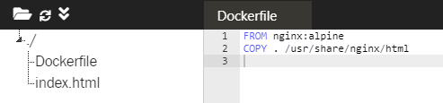

# PRAKTIKUM KCC MINGGU 6

URL

https://www.katacoda.com/courses/docker/deploying-first-container

https://www.katacoda.com/courses/docker/create-nginx-static-web-server

https://www.katacoda.com/courses/docker/2

STEP 1 "UNTUK MENCARI IMAGE UNTUK REDIS"

gunakan perintah ```docker search redis```

```
$ docker search redis
NAME                             DESCRIPTION                                     STARS               OFFICIAL            AUTOMATED
redis                            Redis is an open source key-value store that…   7412                [OK]
bitnami/redis                    Bitnami Redis Docker Image                      129                                     [OK]
sameersbn/redis                                                                  77                                      [OK]
grokzen/redis-cluster            Redis cluster 3.0, 3.2, 4.0 & 5.0               61
rediscommander/redis-commander   Alpine image for redis-commander - Redis man…   31                                      [OK]
kubeguide/redis-master           redis-master with "Hello World!"                30
redislabs/redis                  Clustered in-memory database engine compatib…   23
oliver006/redis_exporter          Prometheus Exporter for Redis Metrics. Supp…   18
arm32v7/redis                    Redis is an open source key-value store that…   17
redislabs/redisearch             Redis With the RedisSearch module pre-loaded…   17
webhippie/redis                  Docker images for Redis                         10                                      [OK]
s7anley/redis-sentinel-docker    Redis Sentinel                                  9                                       [OK]
insready/redis-stat              Docker image for the real-time Redis monitor…   8                                       [OK]
redislabs/redisgraph             A graph database module for Redis               8                                       [OK]
bitnami/redis-sentinel           Bitnami Docker Image for Redis Sentinel         8                                       [OK]
arm64v8/redis                    Redis is an open source key-value store that…   6
centos/redis-32-centos7          Redis in-memory data structure store, used a…   4
redislabs/redismod               An automated build of redismod - latest Redi…   4                                       [OK]
circleci/redis                   CircleCI images for Redis                       2                                       [OK]
frodenas/redis                   A Docker Image for Redis                        2                                       [OK]
runnable/redis-stunnel           stunnel to redis provided by linking contain…   1                                       [OK]
tiredofit/redis                  Redis Server w/ Zabbix monitoring and S6 Ove…   1                                       [OK]
wodby/redis                      Redis container image with orchestration        1                                       [OK]
cflondonservices/redis           Docker image for running redis                  0
xetamus/redis-resource           forked redis-resource                           0                                       [OK]
```

untuk menjalankan dilatar belakang

gunakan perintah ```docker run -d redis```

```
$ docker run -d redis
a2dd792900f9ef6e5d2922bc446f87a2c8df34d0560ce4f2c372a7850ead0710
```

STEP 2 "MENCARI KONTAINER YANG BERJALAN"

gunakan perintah ```docker ps```

```
$ docker ps
CONTAINER ID        IMAGE               COMMAND                  CREATED             STATUS              PORTS               NAMES
a2dd792900f9        redis               "docker-entrypoint.s…"   12 minutes ago      Up 12 minutes       6379/tcp            fervent_agnesi
$ docker ps
CONTAINER ID        IMAGE               COMMAND                  CREATED             STATUS              PORTS               NAMES
a2dd792900f9        redis               "docker-entrypoint.s…"   13 minutes ago      Up 13 minutes       6379/tcp            fervent_agnesi
$
```

perintah ini juga menampilkan nama dan ID yang dikenali yang dapat digunakan untuk mencari tahu informasi tentang masing-masing container.

STEP 3 "MENGASKSES REDIS"

gunakan perintah 

``` docker run -d --name redisHostPort -p 6379:6379 redis:latest```

```
$ docker run -d --name redisHostPort -p 6379:6379 redis:latest
27a5ff87c2ed35c3aeaee1f4f966fd7215ef5f7dbb2462adb204bcb679318474
```

STEP 4 "MENGASKSES REDIS"

gunakan perintah

```docker run -d --name redisDynamic -p 6379 redis:latest```

```
docker run -d --name redisDynamic -p 6379 redis:latest
```

Sementara ini berhasil, sekarang tidak tahu port mana yang telah ditetapkan. Untungnya, ini ditemukan via

``` docker port redisDynamic 6379```

```
$ docker port redisDynamic 6379
0.0.0.0:32768
```

STEP 5 "PERSISTING DATA"

gunakan perintah 

```docker run -d --name redisMapped -v /opt/docker/data/redis:/data redis```

```
$ docker run -d --name redisMapped -v /opt/docker/data/redis:/data redis
ab09818c890944ecea1ad911ce62dfa768d35038960fd77a95fe633d839c8064
```

STEP 6 "MENJALANKAN CONTAINER DI LATAR BELAKANG"

gunakan perintah 

``` $ docker run ubuntu ps
  PID TTY          TIME CMD
    1 ?        00:00:00 ps
docker run -it ubuntu bash
$ docker run -it ubuntu bash ```

Menyebarkan Situs HTML Statis sebagai Wadah


Step 1 - Create Dockerfile

``` FROM nginx:alpine
COPY . /usr/share/nginx/html ```



Step 2 - Build Docker Image

``` $ Step 1 - Create Dockerfile
bash: Step: command not found
$ docker build -t webserver-image:v1 .
Sending build context to Docker daemon  3.072kB
Step 1/2 : FROM nginx:alpine
 ---> dfc78cd150cf
Step 2/2 : COPY . /usr/share/nginx/html
 ---> 7e5896d88ce8
Successfully built 7e5896d88ce8
Successfully tagged webserver-image:v1
$ docker images
REPOSITORY          TAG                 IMAGE ID            CREATED             SIZE
webserver-image     v1                  7e5896d88ce8        2 seconds ago       21.2MB
nginx               alpine              dfc78cd150cf        15 hours ago        21.2MB
ubuntu              latest              16508e5c265d        14 months ago       84.1MB
redis               latest              4e8db158f18d        14 months ago       83.4MB
weaveworks/scope    1.9.1               4b07159e407b        15 months ago       68MB
alpine              latest              11cd0b38bc3c        15 months ago       4.41MB
$ ```
