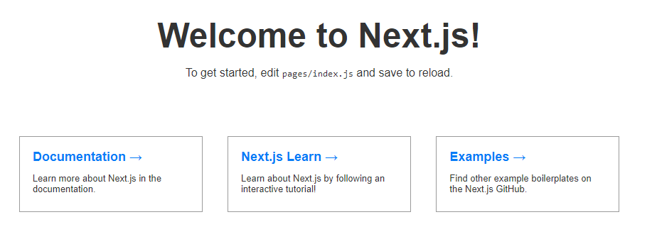

# PRAKTIKUM KCC MINGGU 7

#ZEIT

1. buka ZEIT.com
2. daftar menggunakan github anda
3. instal node js
4. npm install -g now
```
C:\Users\Student>npm install -g now

> now@16.4.0 preinstall C:\Users\Student\AppData\Roaming\npm\node_modules\now
> node ./scripts/preinstall.js

C:\Users\Student\AppData\Roaming\npm\now -> C:\Users\Student\AppData\Roaming\npm\node_modules\now\dist\index.js
+ now@16.4.0
added 1 package in 9.43s
```
5. login menggunakan email kemudian di verify
```
C:\Users\Student>now login
> We sent an email to rizkyharya38@gmail.com. Please follow the steps provided
  inside it and make sure the security code matches Adorable Quoll.
√ Email confirmed
> Congratulations! You are now logged in. In order to deploy something, run `now`.
```
6. membuat project baru dan di deploy
```
C:\Users\Student>npm init next-app my-next-project
npx: installed 1 in 2.695s
Creating a new Next.js app in C:\Users\Student\my-next-project.

Installing react, react-dom, and next using npm...


> core-js@2.6.10 postinstall C:\Users\Student\my-next-project\node_modules\core-js
> node postinstall || echo "ignore"

+ react-dom@16.10.2
+ react@16.10.2
+ next@9.1.1
added 754 packages from 357 contributors and audited 10230 packages in 199.641s
found 0 vulnerabilities


Success! Created my-next-project at C:\Users\Student\my-next-project
Inside that directory, you can run several commands:

  npm run dev
    Starts the development server.

  npm run build
    Builds the app for production.

  npm start
    Runs the built app in production mode.

We suggest that you begin by typing:

  cd my-next-project
  npm run dev
```

7. kemudian "cd my-next-project"
```
C:\Users\Student>cd my-next-project
C:\Users\Student\my-next-project>
```

8. setelah itu "now"
```
C:\Users\Student\my-next-project>now
> Deploying ~\my-next-project under rizkyharya38
> Using project my-next-project
> NOTE: This is the first deployment in the my-next-project project. It will be promoted to production.
> NOTE: To deploy to production in the future, run `now --prod`.
> https://my-next-project-4sx9c2n17.now.sh [1s]
> Ready! Deployed to https://my-next-project.rizkyharya38.now.sh [in clipboard] [30s]

C:\Users\Student\my-next-project>
```

9. klik link yang disediakan "https://my-next-project.rizkyharya38.now.sh"
