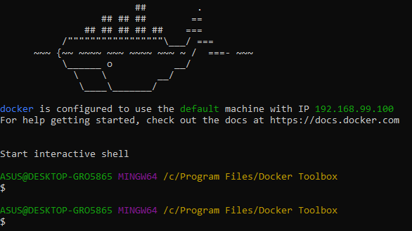
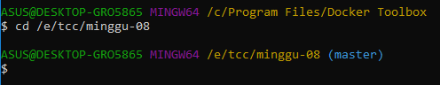
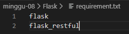
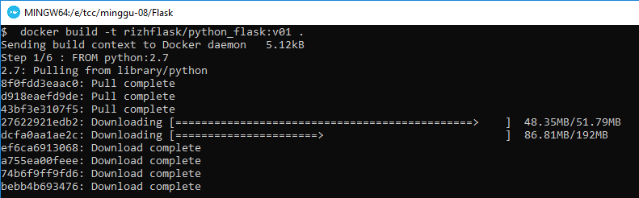
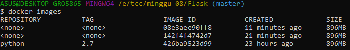

# PRAKTIKUM KCC MINGGU 8

PYTHON DAN FLASK

https://medium.com/@mtngt/docker-flask-a-simple-tutorial-bbcb2f4110b5

1. buka docker

2. buat folder flask.

3. buat file app.py, isinya:

4. buat dile requirement.txt yang didalamnya berisi informasi paket yang dibutuhkan oleh aplikasi python yang akan kita buat diatas

5. kemudian build docker image

6. file app.py, dockerfile & requirement.txt harus di dalam satu folder.

7. cek docker imgage

ternyata image belum terbentuk