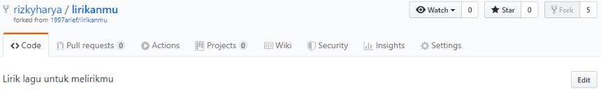

# PRAKTIKUM KCC MINGGU 10
https://github.com/stmik-akakom/rtfm/blob/master/04-kolaborasi.md

COLABORATION

1. menuju project yang akan di kerjakan
klik FORK

2. clone git project tersebut

3. kerjakan project colaboration kemudian di push seperti biasa

4. menuju ke github untuk melakukan "PULL REQUEST"

5. CONFLICT

6. owner mengirimkan pesan untuk memperbaiki
